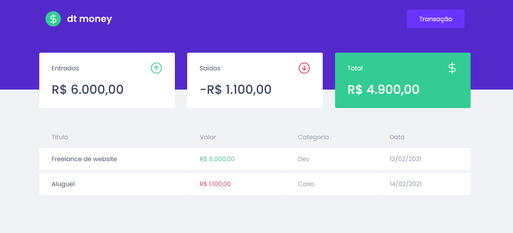
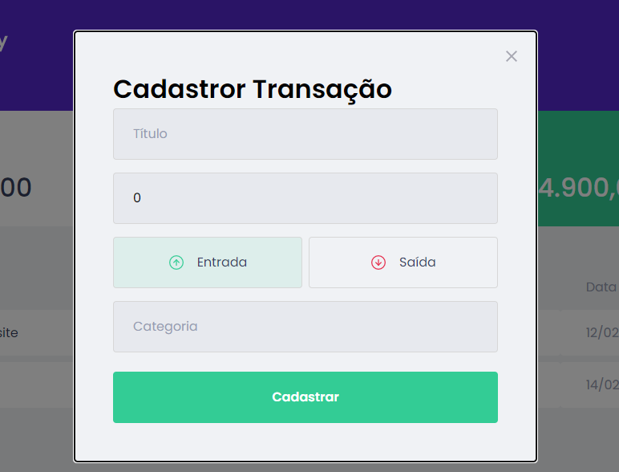

# DTMoney

## 📚 Indice
- [Sobre](#-sobre)
- [Prints](#-prints)
- [Tecnologias Utilizadas](#-tecnologias-utilizadas)
- [Como baixar o projeto](#-como-baixar-o-projeto)

## 📑 Sobre

O projeto **DT Money** 

## 📷 Prints
### Página de Home


### Criando Nova Transação



## 💻 Tecnologias utilizadas

- [Typescript](https://www.typescriptlang.org/docs/)
- [styled-components](https://styled-components.com/)
- [Axios](https://axios-http.com/ptbr/docs/intro)
- [miragejs](https://miragejs.com/tutorial/intro/)


## 💾 Como baixar o projeto

```bash
# Clonar o repositório
git clone https://github.com/andresgois/dtmoney.git
# Acessar o diretório
cd dtmoney
# Instalar as dependências do projeto
yarn install
# Iniciar o projeto
yarn start
```
